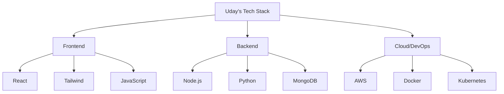

  

  

## 🚀 𝗠𝘆 𝗧𝗲𝗰𝗵 𝗦𝘁𝗮𝗰𝗸

  

  

## 📈 𝗚𝗶𝘁𝗛𝘂𝗯 𝗦𝘁𝗮𝘁𝘀

https://github-readme-stats.vercel.app/api?username=udvThe&show_icons=true&theme=radical&hide_border=true
https://github-readme-stats.vercel.app/api/top-langs/?username=udvThe&layout=compact&theme=radical&hide_border=true

